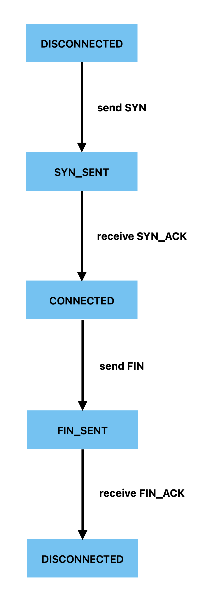

# SEC32 Security Protocol
Version 0.1

## Contents

    1. Purpose
    2.	Terminology / node roles
        2.1 Sensor node
        2.2 Controller node
        2.3 Camera node
    3.	Transport
    4.	Packet format
        4.1 Wire format
        4.2 Header layout
        4.3 Header fields
        4.4 Note IDs
        4.5 Packet examples
    5.	Message types
        5.1 Message type registry
        5.2 Connection control messages
        5.3 Sensor messages
        5.4 Camera messages
    6.	State machines
    7.	Message sequences
    8.	Timeouts & retries
    9.	Error handling
    10.	Security
    11.	Version history

## 3. Transport
**Technology:** ESP-NOW

**Nodes:**

- SENSOR: detects security related events
- CONTROLLER: central node responsible for coordiating the security system.
- CAMERA: handles image capture requests

A SENSOR initiates a connection. 

A CONTROLLER accepts connections

A CAMERA receives commands from the CONTROLLER. 

## 4. Packet format

### 4.1  Wire format:

All multi-byte integer fields are transmitted in **big-endian (network byte order).** Single-byte fields are of course unaffected by byte order.

Example:

    Sequence = 42
    Decimal  = 42
    Hex      = 0x002A
    Wire     = 00 2A

#### 4.2  Header layout

    Byte offset
        0         1       2      3      4    5      6
    +---------+--------+------+------+----------+--------+
    | Version | Source | Dest | Type | Sequence | Length |
    +---------+--------+------+------+----------+--------+
       1 byte   1 byte  1 byte 1 byte   2 bytes   1 byte

#### 4.3 Header fields

| Offset | Size | Field | Definition |
|--------|------|-------|------------|
| 0 | 1 byte | version | protocol version |
| 1 | 1 byte | source | node ID sender |
| 2 | 1 byte | destination | node ID receiver |
| 3 | 1 byte | type | message type |
| 4 | 2 bytes | sequence | transaction ID |
| 6 | 1 byte | payloadLength | length of payload |
| 7 | N bytes | payload | message-dependent data |

**Sequence**

The sequence field identifies a single protocol transaction. The node that initiates a transation selects the sequence number. All response messages that belong to this transaction MUST use the same sequence number. 

Example:

SYN     sequence = 42
SYN_ACK sequence = 42
ACK     sequence = 42

A new transaction uses a new sequence number:

FIN     sequence = 43
FIN_ACK sequence = 43

Retransmissions of the same transaction, e.g. after timeout, MUST reuse the originale sequence number. 

The initial sequence number is 0. The sequence number is incremented when a node initiates a new transaction. After 65535, the sequence number wraps around to 0.

#### 4.4  Node ID registry

The 'source' and 'destination' header fields contain an unsigned 8-bit node ID. Each node in the network MUST have a unique node ID. 

| Value / Range | Node type | Definition |
|---------------|-----------|------------|
| 0x00 | reserved | invalid or unspecified node |
| 0x01 | controller | primary security controller |
| 0x02-0x0F | reserved | reserved for future control nodes |
| 0x10-0x1F | sensor | sensor nodes |
| 0x20-0xFE | camera | camera nodes |
| 0x30-0xFE | reserved | reserved for future node types |
| 0xFF | broadcast | all nodes |

#### 4.5  Assigned node IDs

| Node ID | Node | Role |
|---------|------|------|
| 0x01 | Controller | Central controller |
| 0x10 | Sensor 1 | First sensor node |
| 0x20 | Camera 1 | ESP32-CAM front door |

#### 4.6 Packet examples 

**Example: SYN Packet**

    offset:      0        1       2      3      4     5      6
             +-------+-------+------+------+------+-----+------+
    SYN      |  01   |   01  |  02  |  01  |  00  |  2A |  00  |
             +-------+-------+------+------+------+-----+------+

**Field breakdown**
- Byte 0 (0x01): version = 1
- Byte 1 (0x01): source = 1 (Sensor 1)
- Byte 2 (0x02): destination = 2 (Controller)
- Byte 3 (0x01): type = 1 (SYN)
- Bytes 4-5 (0x00 0x2A): sequence = 42
- Byte 6 (0x00): payloadLength = 0 (no payload)

## 5. Message types

- SYN = I want to start a session
- SYN_ACK = OK, I have received your SYN
- ACK = I have received your reply
- FIN = I want to close the connection
- FIN_ACK = I have received your FIN 
- HEARTBEAT = I’m still online
- EVENT = something happened
- CAM_TRIGGER = take a picture

## 6. STATE MACHINES

#### CONNECTION STATE

**Sensor node**

Transition table:

| Current state | Event | Action | New state |
|---------------|-------|--------|-----------|
| DISCONNECTED | Connection start requested | Send SYN | SYN_SENT |
| SYN_SENT | Receive valid SYN_ACK | Send ACK | CONNECTED
| CONNECTED | Disconnect requested | Send FIN | FIN_SENT |
| FIN_SENT | Redeive valid FIN_ACK | Close session | DISCONNECTED |

**Controller node**

Transition table:

| Current state | Event | Action | New state |
|---------------|-------|--------|-----------|
| DISCONNECTED | Receive valid SYN | Send SYN_ACK | SYN_RECEIVED |
| SYN_RECEIVED | Receive valid ACK | Accept session | CONNECTED |
| CONNECTED | Receive valid FIN | Send FIN_ACK | FIN_RECEIVED |
| FIN_RECEIVED | FIN_ACK sent | Close session | DISCONNECTED |

**Camera node**

#### SECURITY STATE

**Sensor node**

**Controller node**

**Camera node**
